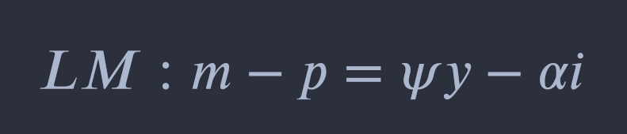
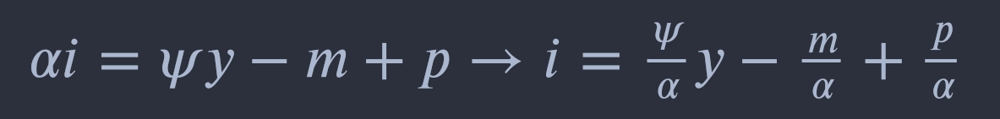
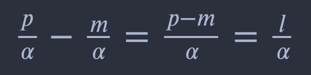
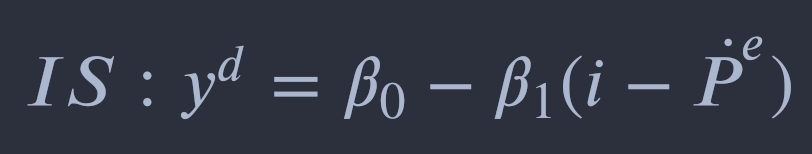
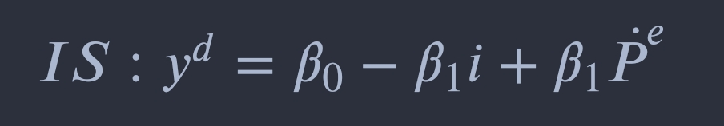
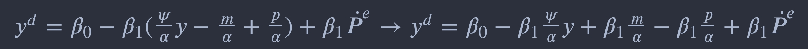
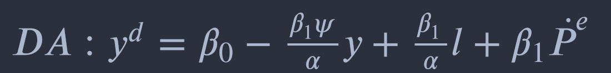
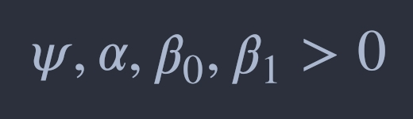

# Modelo básico para una economía cerrada

	

	El presente modelo macroeconómico es desarrollando de acuerdo al primer capitulo del libro mencionado en la 
	descripción del repositorio, es necesario precisar que el análisis económico para México se encuentra en la 
	Notebook de Python junto al respectivo código, por lo tanto, aquí se explicará la teoría descrita en el libro.
	  
	Supuestos:
		<ul>
			<li> Previsión perfecta de las expectativas de inflación </li>
			<li> Precios rígidos a corto plazo y flexibles a largo plazo </li>
		</ul>
	 
	Las ecuaciones originarias son las siguientes:
	  
	Ecuación de la oferta-demanda de dinero (LM)
	 
	
	 
	Desarrollo de la ecuación
	
	 
	
	 
	Ecuación de la inversión-ahorro general (IS)
	 
	
	 
	Desarrollo de la ecuación
	
	 
	
	 
	Ecuación de la demanda agregada (DA)
	 
	
	 
	Obedeciendo las restricciones:
	
	

