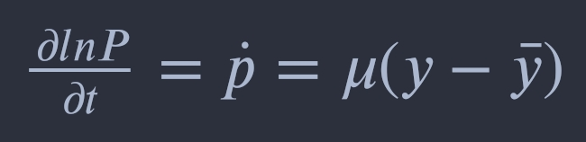
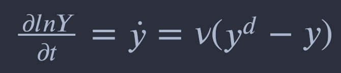
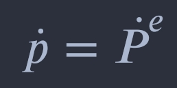

# Modelo básico para una economía cerrada

	

	El presente modelo macroeconómico es desarrollando de acuerdo al primer capitulo del libro mencionado en la 
	descripción del repositorio, es necesario precisar que el análisis económico para México se encuentra en la 
	Notebook de Python junto al respectivo código, por lo tanto, aquí se explicará la teoría descrita en el libro.
	  
	Supuestos:
		<ul>
			<li> Previsión perfecta de las expectativas de inflación </li>
			<li> Precios rígidos a corto plazo y flexibles a largo plazo </li>
		</ul>
	 
	Las ecuaciones originarias son las siguientes:
	  
	<b>
		Ecuación de la oferta-demanda de dinero (LM)
	</b>
	 
	
	 
	<b>
		Desarrollo de la ecuación
	</b>
	
	 
	
	 
	<b>
		Ecuación de la inversión-ahorro general (IS)
	</b>
	 
	
	 
	<b>
		Desarrollo de la ecuación
	</b>
	
	 
	
	 
	<b>
		Ecuación de la demanda agregada (DA)
	</b>
	 
	
	 
	<b>
		Obedeciendo las restricciones:
	</b>
	
	<b>
		Dinámica de precios
	</b>
	
	<b>
		Dinámica de la oferta
	</b>
	
	<b>
		Previsión perfecta
	</b>
	
	 
	Todas las variables antes mencionadas están expresadas en logaritmos, exceptuando los índices, donde:
		<ul>
			<li> "m" es el stock nominal de dinero.
			<li> "p" es el nivel de precios.
			<li> "yd" es la demanda en términos reales.
			<li> "y" es la producción real.
			<li> "r" es el tipo de interés real.
			<li> "i" es el tipo de interés nominal.
			<li> 
			<li>
			<li>
			<li>
			<li>	
		</ul>
	

